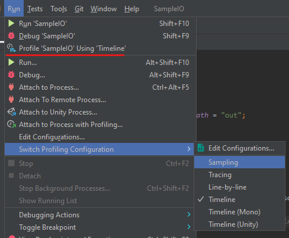
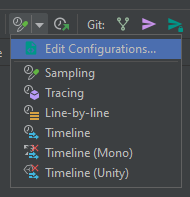
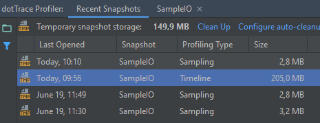
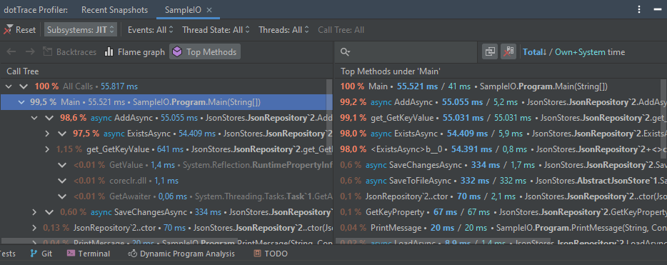
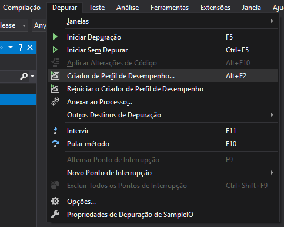
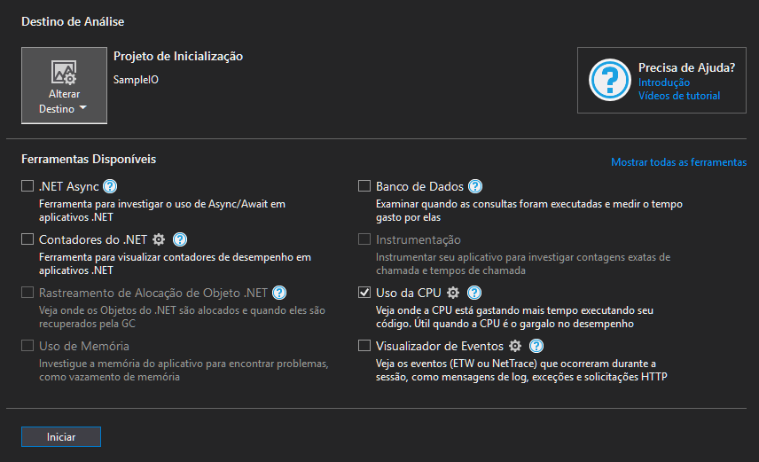
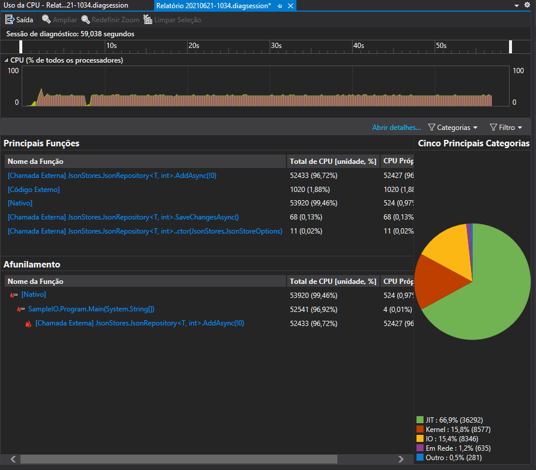
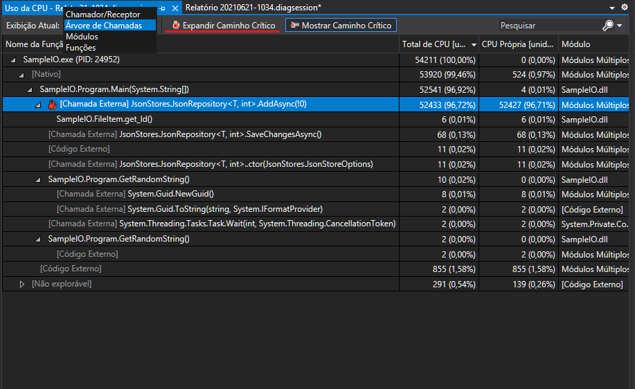

# Capturas de tela dos profilers

[Voltar](Entrega.md)

## JetBrains Rider

>Opções do menu

>Botão na barra de ferramentas

>Lista de snapshots gerados

>Resultados do Rider

## Microsoft Visual Studio

>Opções do menu

>Profilers disponíves

>Resultados do Visual Studio, com gráficos

>Detalhes da execução, com o caminho crítico destacado
