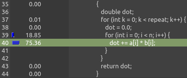
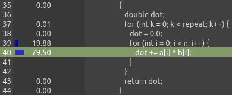

# T2 - ELC 139

Augusto César Bisognin
Sistemas de Informação - UFSM
ELC139 (Programação Paralela)

## Parte 1

### 1.1

Ao analisar as execuções do programa, pude perceber que os resultados seguiam um certo padrão de acordo os parâmetros. Quando alterava o primeiro parâmetro, o programa gastava praticamente o mesmo tempo realizando as multiplicações. Ao aumentar o número de repetições, o custo do `for` tinha um leve aumento.

 

>Execuções com os parâmetros `3000 90` e `3000 900`, respectivamente

### 1.2

O principal custo da aplicação estava na linha 40 das imagens acima. O programa realiza uma multiplicação e somas os resultados. Visto que a ordem das multiplicações não alteraria o resultado, seria possivel paralelizar essa operação sem muitas alterações no código.

## Parte 2

### O programa

Para os testes, implementei uma aplicação C#, [Random JSON creator](https://github.com/augustocb23/random-json), que utiliza a biblioteca [JSON Stores](https://github.com/augustocb23/json-stores), também criada por mim.

O programa recebe como parâmetros o número de arquivos a serem gerados e a quantidade de items a serem adicionados em cada arquivo. Cada item consiste em um ID numérico e um [GUID](https://pt.wikipedia.org/wiki/Identificador_%C3%BAnico_universal).

### Os profilers

Utilizei os profilers pré-instalados nas IDEs [Rider](https://www.jetbrains.com/pt-br/rider/) e [Visual Studio](https://visualstudio.microsoft.com/pt-br).

Ambas não exigiram nenhuma configuração adicional e são fáceis de encontrar através da interface da IDE.

[Capturas de tela dos profilers](Capturas.md)

#### JetBrains Rider

No menu `Run`, há a opção `Profile '[nome-projeto]' using '[profiler]'`. É possível alterar o profiler pela opção `Switch Profilling Configuration`. Após executar ao menos uma vez, fica visível um botão na barra de ferramentas para executar novamente o profiler, com um menu para alterar a configuração. Os dados gerados ficam salvos e podem ser facilmente acessados.

#### Microsoft Visual Studio

No menu `Depurar`, há a opção `Criador de Perfil de Desempenho...`, onde há várias opções de profilling. Após a execução, os resultados são exibidos junto com gráficos. Ao clicar em um método, uma segunda aba abre com informações detalhadas, com a opção de destacar o caminho crítico da aplicação. Ao contrário do Rider, os resultados _não_ são salvos automaticamente.

### Resultados obtidos

Ao analisar a aplicação, um resultado que chamou a atenção foi o alto custo para adicionar itens à lista. Há uma checagem pelo ID do item, para garantir unicidade. Essa checagem consumiu 98% do tempo da aplicação.

Mesmo as operações de I/O foram muito mais rápidas. Para 10 arquivos com 200 itens, a persistência dos arquivos consumiu apenas ~0.3 segundo (em um computador com SSD), algo despresível se comparado com o total de quase um minuto de execução.

### Dúvidas e/ou dificuldades

Ambas as IDEs são extremamente fáceis de usar e os resultados obtidos foram bastante semelhantes. Não tive nenhuma dificuldade em gerar os perfis, mas demorei um pouco para entender as diferenças entre as várias opções existentes.
